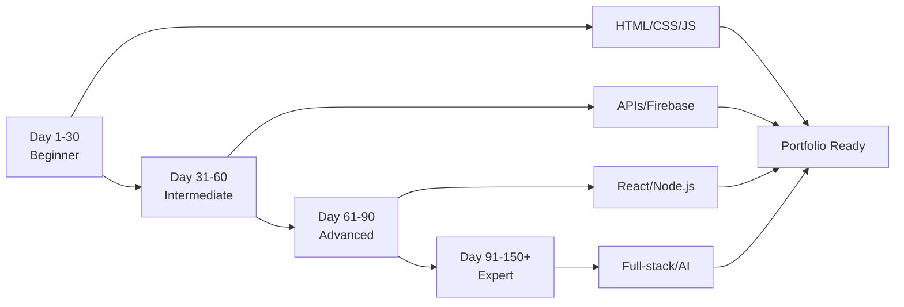

<p align="center">
  
</p>


<h1 align="center">🚀 100 Days of Web Development Challenge</h1>

<p align="center">
  Level up your <strong>frontend skills</strong> with this <strong>100 Days of Web Development Challenge</strong> using <strong>HTML, CSS & JavaScript</strong>. Build <strong>mini-projects</strong>, practice <strong>daily coding</strong>, and create a <strong>portfolio-worthy collection</strong>!
</p>

<p align="center">
  
  
  
  
  
  
</p>

<p align="center">
  <a href="https://100dayswebdevelopment-ecwoc.netlify.app/website/pages/projects">🌐 Live Website</a> •
  <a href="https://discord.gg/BFTWMU6p">💬 Discord Community</a> •
  <a href="CONTRIBUTING.md">🤝 Contribute</a>
</p>

---

## 📌 About This Challenge

This repository documents my **100+ Days of Web Development journey**, where I:

- 🎯 Learn and **practice frontend fundamentals** daily
- 💻 Build **150+ mini-projects & real-world apps**
- 📊 Track progress with **interactive tools & visuals**
- 🔥 Strengthen **problem-solving & coding consistency**
- 🌟 Create a **portfolio-worthy project collection**

---

## ✨ Key Features

- **🎯 150+ Projects**: From beginner to advanced level
- **📊 Progress Tracker**: Interactive heatmap to visualize coding streaks
- **🗂️ Project Showcase**: Beautiful, searchable and filterable project gallery
- **🎨 Modern UI/UX**: Glassmorphism design with smooth animations
- **📱 Fully Responsive**: Works perfectly on all devices
- **🌐 Live Demos**: Every project deployed and accessible

---

## 🗺️ Learning Roadmap

<p align="center">
  
  
  
</p>

### 🎯 Phase 1: Foundation (Days 1-30) - Beginner

<details open>
<summary><b>📚 Core Skills: HTML, CSS, JavaScript Basics</b></summary>

| Day | Project | Skills Learned |
|-----|---------|---------------|
| 1 | Personal Portfolio | HTML Structure, CSS Styling, Flexbox |
| 2 | Responsive Landing Page | Media Queries, Grid Layout |
| 3 | Todo List | DOM Manipulation, Event Listeners |
| 4 | Weather App | API Integration, Fetch API |
| 5 | Calculator | JavaScript Logic, Functions |
| 6 | Quiz App | Conditional Logic, Arrays |
| 7 | Expense Tracker | Local Storage, Data Management |
| 8 | Pomodoro Timer | setInterval, Date Objects |
| 9 | Note Taking App | CRUD Operations, Storage |
| 10 | Recipe Book | Template Strings, Array Methods |
| 11-20 | Blog, E-commerce, Chat UI, Music Player, Drawing App, Password Generator, Unit Converter, Countdown Timer, Tip Calculator, QR Code Generator | Advanced CSS, Canvas API, Security |
| 21-30 | Flashcards, Markdown Previewer, Currency Converter, BMI Calculator, Quote Generator, Image Gallery, Dice Roller, Rock Paper Scissors, Memory Game, Tic Tac Toe | Game Logic, API Integration, Animations |

**🎓 Skills Mastered:** HTML5, CSS3, Vanilla JavaScript, DOM, Local Storage, Basic APIs

</details>

---

### 🚀 Phase 2: Intermediate (Days 31-60)

<details>
<summary><b>���� Real-World Applications: APIs, Firebase, Advanced JavaScript</b></summary>

| Day | Project | Skills Learned |
|-----|---------|---------------|
| 31 | Job Board | Dynamic Content, Filtering |
| 32 | Social Media Dashboard | Data Visualization, Charts |
| 33 | Real Estate Website | Complex Layouts, Forms |
| 34 | Hotel Booking System | Date Pickers, Validation |
| 35 | Food Delivery App | Cart Logic, State Management |
| 36 | Fitness Tracker | Progress Tracking, Charts |
| 37 | Event Management | Calendar Integration, Scheduling |
| 38 | Booking Appointment System | Time Management, Notifications |
| 39 | Online Learning Platform | Video Integration, Progress |
| 40 | Movie Database | TMDB API, Search Functionality |
| 41-50 | GitHub Profile Finder, Stock Tracker, News Aggregator, Chat App (Firebase), Project Management, E-commerce Cart, Banking Dashboard, Flight Booking, Recipe Sharing, Blog with CMS | Firebase, Real-time Data, Node.js Basics |
| 51-60 | Portfolio+Blog, Task Board, File Uploader, Code Editor, Voice Notes, Expense Splitter, Habit Tracker, Budget Planner, Meal Planner, Travel Planner | Web Speech API, File APIs, Advanced State |

**🎓 Skills Mastered:** REST APIs, Firebase, Node.js Basics, Web APIs, Complex State Management

</details>

---

### 🔥 Phase 3: Advanced (Days 61-90)

<details>
<summary><b>⚡ Modern Stack: React, WebRTC, Socket.io, AI Integration</b></summary>

| Day | Project | Skills Learned |
|-----|---------|---------------|
| 61 | Fullstack E-commerce | React, MongoDB, Express |
| 62 | GitHub Stats Dashboard | GitHub API, Data Viz |
| 63 | Video Conferencing | WebRTC, Peer Connections |
| 64 | Online Code Editor | Monaco Editor, Compilers |
| 65 | Real-time Collaboration | Socket.io, Operational Transform |
| 66 | Stock Trading Simulator | Real-time Data, Charts |
| 67 | Multiplayer Game | Canvas, Socket.io, Game Logic |
| 68 | AI Chatbot | OpenAI API, NLP |
| 69 | Open-Source E-commerce Template | Modular Architecture |
| 70 | Data Visualization Dashboard | D3.js, Complex Charts |
| 71-80 | Portfolio Template, IoT Dashboard, ML UI (TensorFlow.js), Voice Assistant, AR Web App, PWA News App, Real-time Analytics, Learning Games, Job Platform, Project Management SaaS | TensorFlow.js, WebXR, Three.js, PWA |
| 81-90 | Healthcare Portal, E-learning Platform, AI Tools Directory, Chat Support, UI Component Library, Food Delivery System, Personal Assistant, Video Streaming, Smart Home, Enterprise CRM | Next.js, Prisma, React Native, HLS.js |

**🎓 Skills Mastered:** React, Next.js, WebRTC, Socket.io, AI/ML, Progressive Web Apps, Advanced Backend

</details>

---

### 🏆 Phase 4: Capstone (Days 91-150+)

<details>
<summary><b>🌟 Expert Level: Full-stack, AI, Blockchain, Production Apps</b></summary>

| Days | Project Category | Technologies |
|------|-----------------|--------------|
| 91-100 | **Platform Clones** | LeetCode Clone, Hackathon Website, Open Source Contribution, PWA, MERN Stack, AI-Powered App, Smart Community Hub, Campus Platform, Music App (Spotify API), Survival Protocol |
| 101-120 | **Creative & Advanced** | Canvas Particle Animation, Interactive Storytelling, README Toolkit, 3D Model Viewer, Form Builder, Dashboard (D3.js), Solar System, AI Image Editor, Custom CMS, Advanced E-commerce, Social Network, LMS |
| 121-140 | **AI & Blockchain** | AI Resume Builder, Smart Contracts (Solidity), Advanced Blog (GraphQL), AI Chat App, Sustainable Dev Platform, AI Code Review Tool, Social Media Platform, AI Image Recognition, Ultimate Kanban, AI Translation App, Advanced CRM, Virtual Assistant, Inventory Management, Sentiment Analysis |
| 141-150+ | **Production Ready** | Time Tracking (ApexCharts), AI SEO Tool, Recruitment Platform, AI Social Media Manager, Chess Game, AI Customer Support, Financial Planning, AI Document Summarizer, Knowledge Base, AI Video Analysis, Mini Geo Guesser, Newsly, Snake Game, Tetris, Time Fracture Arena |

**🎓 Skills Mastered:** Full-stack Development, AI/ML Integration, Blockchain, Production Deployment, System Design

</details>

---

### 📈 Skill Progression Chart



---

### 🎯 Recommended Learning Path

```
Week 1-4:   Master HTML, CSS, Vanilla JS fundamentals
Week 5-8:   API integration, Local Storage, Firebase basics
Week 9-12:  React, State Management, Backend basics
Week 13-16: Advanced frameworks, Real-time apps, WebRTC
Week 17-20: AI/ML integration, Blockchain, Production deployment
Week 20+:   Build capstone projects, Contribute to open source
```

---

### 💡 Tips for Success

<table>
  <tr>
    <td>
      <h4>✅ Do's</h4>
      <ul>
        <li>Code every single day</li>
        <li>Build projects from scratch</li>
        <li>Document your learning</li>
        <li>Share on social media</li>
        <li>Help other learners</li>
        <li>Review previous projects</li>
      </ul>
    </td>
    <td>
      <h4>❌ Don'ts</h4>
      <ul>
        <li>Skip difficult topics</li>
        <li>Copy-paste without understanding</li>
        <li>Rush through projects</li>
        <li>Learn too many things at once</li>
        <li>Compare your progress</li>
        <li>Give up on errors</li>
      </ul>
    </td>
  </tr>
</table>

---

## 🎯 Challenge Goals

- ✅ Master HTML, CSS & JavaScript fundamentals
- ✅ Build 150+ real-world frontend projects
- ✅ Improve GitHub contribution consistency
- ✅ Prepare for Open Source, Internships & GSoC
- ✅ Build a strong developer portfolio
- ✅ Learn modern frameworks (React, Next.js, Node.js)

---

## 📂 Project Categories

<table align="center">
  <tr>
    <td align="center" width="25%">
      <h3>🟢 Beginner</h3>
      <p><strong>Days 1-30</strong></p>
      <p>HTML, CSS, Vanilla JS</p>
      <a href="https://100dayswebdevelopment-ecwoc.netlify.app/website/pages/projects">View Projects</a>
    </td>
    <td align="center" width="25%">
      <h3>🟡 Intermediate</h3>
      <p><strong>Days 31-60</strong></p>
      <p>APIs, Local Storage, Firebase</p>
      <a href="https://100dayswebdevelopment-ecwoc.netlify.app/website/pages/projects">View Projects</a>
    </td>
    <td align="center" width="25%">
      <h3>🔴 Advanced</h3>
      <p><strong>Days 61-90</strong></p>
      <p>React, Node.js, WebRTC</p>
      <a href="https://100dayswebdevelopment-ecwoc.netlify.app/website/pages/projects">View Demo</a>
    </td>
    <td align="center" width="25%">
      <h3>🔥 Capstone</h3>
      <p><strong>Days 91-150+</strong></p>
      <p>Full-stack, AI, Blockchain</p>
      <a href="https://100dayswebdevelopment-ecwoc.netlify.app/website/pages/projects">View Projects</a>
    </td>
  </tr>
</table>

---

## 🚀 Featured Projects

<table>
  <tr>
    <td width="50%">
      <h3>🌤️ Weather App</h3>
      <p>Real-time weather data with beautiful glassmorphism UI</p>
      <p><strong>Tech:</strong> HTML, CSS, JS, Open-Meteo API</p>
      <a href="https://100dayswebdevelopment-ecwoc.netlify.app/website/pages/projects">View Demo</a>
    </td>
    <td width="50%">
      <h3>💬 Chat Application</h3>
      <p>Real-time messaging with Firebase integration</p>
      <p><strong>Tech:</strong> HTML, CSS, JS, Firebase</p>
      <a href="https://100dayswebdevelopment-ecwoc.netlify.app/website/pages/projects">View Demo</a>
    </td>
  </tr>
  <tr>
    <td width="50%">
      <h3>🎮 Memory Game</h3>
      <p>Interactive card-matching game with score tracking</p>
      <p><strong>Tech:</strong> HTML, CSS, JavaScript</p>
      <a href="https://100dayswebdevelopment-ecwoc.netlify.app/website/pages/projects">View Demo</a>
    </td>
    <td width="50%">
      <h3>📊 Data Visualization Dashboard</h3>
      <p>Interactive charts and graphs using D3.js</p>
      <p><strong>Tech:</strong> D3.js, JavaScript, HTML, CSS</p>
      <a href="https://100dayswebdevelopment-ecwoc.netlify.app/website/pages/projects">View Demo</a>
    </td>
  </tr>
</table>

<p align="center">
  <a href="https://100dayswebdevelopment-ecwoc.netlify.app/website/pages/projects"><strong>🔍 Explore All 150+ Projects →</strong></a>
</p>

---

## 💡 Beyond 150 Projects - Your Choice!

<p align="center">
  
</p>

After completing **150+ projects**, you have the foundation to build **real, useful things** that solve actual problems! 

### 🌟 What You Can Build Next:

<table>
  <tr>
    <td width="33%" align="center">
      <h4>🛠️ Build Your Own Tools</h4>
      <p>Create utilities that solve your daily problems</p>
      <ul align="left">
        <li>Personal productivity apps</li>
        <li>Automation scripts</li>
        <li>Developer tools</li>
        <li>Browser extensions</li>
      </ul>
    </td>
    <td width="33%" align="center">
      <h4>🚀 Launch a Startup</h4>
      <p>Turn your ideas into real products</p>
      <ul align="left">
        <li>SaaS applications</li>
        <li>Mobile apps</li>
        <li>AI-powered tools</li>
        <li>Marketplaces</li>
      </ul>
    </td>
    <td width="33%" align="center">
      <h4>🌍 Contribute to Open Source</h4>
      <p>Make an impact on real projects</p>
      <ul align="left">
        <li>Fix bugs in popular repos</li>
        <li>Add new features</li>
        <li>Create documentation</li>
        <li>Mentor newcomers</li>
      </ul>
    </td>
  </tr>
</table>

---

### 🎯 Ideas for Real, Useful Projects:

<details>
<summary><b>💼 For Students & Educators</b></summary>

- **Campus Management System** - Attendance, assignments, grades
- **Study Group Matcher** - Connect students studying same subjects
- **Resource Sharing Platform** - Notes, books, study materials
- **Exam Preparation Tool** - Mock tests, flashcards, progress tracking
- **Project Collaboration Hub** - Team formation, version control, communication

</details>

<details>
<summary><b>🏢 For Freelancers & Businesses</b></summary>

- **Invoice & Expense Manager** - Track income, expenses, generate invoices
- **Client Portal** - Project updates, file sharing, communication
- **Time Tracking Tool** - Billable hours, productivity analytics
- **Portfolio Generator** - Auto-generate portfolios from GitHub
- **Lead Management System** - CRM for small businesses

</details>

<details>
<summary><b>🌱 For Social Impact</b></summary>

- **Local Community Platform** - Connect neighbors, local events
- **Volunteer Matching App** - Connect volunteers with NGOs
- **Environmental Tracker** - Carbon footprint, eco-challenges
- **Mental Health Support** - Anonymous chat, resources, meditation
- **Food Donation Network** - Connect restaurants with shelters

</details>

<details>
<summary><b>🎮 For Creative Developers</b></summary>

- **Interactive Storytelling Engine** - Choose-your-own-adventure creator
- **Music Collaboration Platform** - Real-time jam sessions
- **Art Portfolio Showcase** - Beautiful galleries for artists
- **Game Development Toolkit** - Drag-and-drop game builder
- **Animation Studio** - Browser-based animation tool

</details>

<details>
<summary><b>🤖 For AI Enthusiasts</b></summary>

- **Personal AI Assistant** - Custom ChatGPT for your needs
- **Code Review Bot** - AI-powered code suggestions
- **Content Generator** - Blog posts, social media, marketing
- **Image Enhancement Tool** - AI upscaling, background removal
- **Voice Clone App** - Text-to-speech with your voice

</details>

<details>
<summary><b>🔧 For Developers</b></summary>

- **API Testing Platform** - Postman alternative
- **Code Snippet Manager** - Personal code library
- **Git Workflow Automation** - Custom CI/CD pipelines
- **Documentation Generator** - Auto-docs from code
- **Performance Monitor** - Website speed analytics

</details>

---

### 💭 The Philosophy

> **"The best time to build something useful was after your first project. The second best time is now."**

After 150+ projects, you've learned:
- ✅ How to structure code
- ✅ How to solve problems
- ✅ How to use modern tools
- ✅ How to learn independently

**Now it's time to:**
- 🎯 Solve **real problems** that matter to you
- 🚀 Build **products people will use**
- 💡 Create **tools that make life easier**
- 🌟 Make **meaningful contributions**

---

### 🎓 Your Next Steps:

1. **Identify a Problem** - What frustrates you daily?
2. **Validate the Idea** - Talk to potential users
3. **Build an MVP** - Start small, iterate fast
4. **Get Feedback** - Ship early, improve constantly
5. **Scale or Pivot** - Grow what works, change what doesn't

---

### 🌈 The Sky's The Limit!

<p align="center">
  <strong>You've completed 150+ projects. You're no longer a beginner.</strong><br>
  <strong>You're a builder. Now go build something amazing! 🚀</strong>
</p>

<p align="center">
  
</p>

---

## 📂 Repository Structure

```
100-Days-Of-Web-Development-ECWoC26/
│
├── 📁 public/                             # 150+ Daily Projects
│   ├── 📁 Day 01 - Personal Portfolio
│   ├── 📁 Day 04 - Weather App
│   ├── 📁 Day 30 - Tic Tac Toe
│   ├── 📁 Day 88 - Video Streaming
│   └── 📁 Day 150+ - Advanced Projects
│
├── 📁 website/                            # Main Portfolio Website
│   ├── 📁 assets/                         # Images, Fonts, Icons
│   ├── 📁 pages/                          # HTML Pages
│   │   ├── projects.html                  # Project Gallery
│   │   ├── login.html                     # Auth System
│   │   └── home.html                      # Landing Page
│   ├── 📁 styles/                         # Modular CSS
│   └── 📁 scripts/                        # JavaScript Logic
│
├── 📄 index.html                          # Entry Point
├── 📄 README.md                           # Documentation
└── 📄 CONTRIBUTING.md                     # Contribution Guide
```

---

## 🔧 Tech Stack

<table>
  <tr>
    <td><strong>Frontend</strong></td>
    <td>HTML5, CSS3, JavaScript (ES6+), TypeScript</td>
  </tr>
  <tr>
    <td><strong>Frameworks</strong></td>
    <td>React, Next.js, Three.js, D3.js</td>
  </tr>
  <tr>
    <td><strong>Backend</strong></td>
    <td>Node.js, Express.js, Python (Flask/Django)</td>
  </tr>
  <tr>
    <td><strong>Database</strong></td>
    <td>Firebase, MongoDB, PostgreSQL</td>
  </tr>
  <tr>
    <td><strong>APIs</strong></td>
    <td>REST APIs, WebRTC, Socket.io, OpenAI</td>
  </tr>
  <tr>
    <td><strong>Tools</strong></td>
    <td>Git, GitHub, VS Code, Netlify</td>
  </tr>
</table>

---

## 🚀 Quick Start

### For Learners

1. **Explore Projects**: Visit [Live Website](https://100dayswebdevelopment-ecwoc.netlify.app/website/pages/projects)
2. **Choose a Project**: Pick one that matches your skill level
3. **Clone & Run**:
   ```bash
   git clone https://github.com/Shubham-cyber-prog/100-Days-Of-Web-Development-ECWoC26.git
   cd 100-Days-Of-Web-Development-ECWoC26
   ```
4. **Open in Browser**: Navigate to any project folder and open `index.html`

### For Contributors

1. **Fork the Repository**: Click the "Fork" button on GitHub
2. **Clone Your Fork**:
   ```bash
   git clone https://github.com/YOUR-USERNAME/100-Days-Of-Web-Development-ECWoC26.git
   cd 100-Days-Of-Web-Development-ECWoC26
   ```
3. **Create a Branch**:
   ```bash
   git checkout -b feature/your-feature-name
   ```
4. **Make Changes**: Add your project or improvements
5. **Commit & Push**:
   ```bash
   git add .
   git commit -m "Add: Your feature description"
   git push origin feature/your-feature-name
   ```
6. **Create Pull Request**: Go to the original repo and create a PR

📖 Read the full [Contributing Guide](CONTRIBUTING.md) for detailed instructions.

---

## 🎯 How to Use This Repository

### 1️⃣ **As a Learning Resource**
- Browse projects by difficulty level
- Study the code and understand the implementation
- Recreate projects to practice your skills

### 2️⃣ **As a Portfolio Template**
- Fork and customize for your own journey
- Replace projects with your implementations
- Showcase your progress to recruiters

### 3️⃣ **As a Contributor**
- Fix bugs or improve existing projects
- Add new features or projects
- Help with documentation and testing

---

## 🌟 Why This Challenge?

- **📚 Structured Learning**: Progress from basics to advanced topics
- **🎯 Real Projects**: Build portfolio-ready applications
- **👥 Community**: Connect with fellow developers
- **🏆 Recognition**: Showcase your commitment to learning
- **💼 Career Ready**: Prepare for interviews and job opportunities

---

## 🤝 Contributing

We welcome contributions from developers of all skill levels! Here's how you can help:

- 🐛 **Fix Bugs**: Found an issue? Submit a PR!
- ✨ **Add Features**: Enhance existing projects
- 📝 **Improve Docs**: Help others understand better
- 🎨 **Design**: Improve UI/UX of projects
- 🧪 **Testing**: Test projects and report issues

Read our [Contributing Guidelines](CONTRIBUTING.md) and [Code of Conduct](CODE_OF_CONDUCT.md).

---

## 📊 Progress Tracker

<p align="center">
  
</p>

<p align="center">
  Track your own progress using our <a href="https://100dayswebdevelopment-ecwoc.netlify.app/website/pages/projects">Interactive Dashboard</a>
</p>

---

## 🏆 Hall of Fame

Thank you to everyone who has contributed to this project! 🙌  
We appreciate your support, commits, issues, ideas, and pull requests 💜

<p align="center">
  <a href="https://github.com/Shubham-cyber-prog/100-Days-Of-Web-Development-ECWoC26/graphs/contributors">
    
  </a>
</p>

> *Every contributor brings this project closer to excellence!*

---

## 📱 Connect With Us

<p align="center">
  <a href="https://discord.gg/BFTWMU6p">
    
  </a>
  <a href="https://100dayswebdevelopment-ecwoc.netlify.app/website/pages/projects">
    
  </a>
  <a href="https://github.com/Shubham-cyber-prog/100-Days-Of-Web-Development-ECWoC26">
    
  </a>
</p>

---

## 📜 License

This project is licensed under the MIT License - see the [LICENSE](LICENSE) file for details.

---

## 🙏 Acknowledgments

- Thanks to all contributors who made this possible
- Special thanks to the ECWoC 2026 organizing team
- Inspired by the #100DaysOfCode challenge
- Built with ❤️ by the developer community

---

<p align="center">
  <strong>🌟 If you find this helpful, please consider giving it a star! 🌟</strong>
</p>

<p align="center">
  Made with 💙 by <a href="https://github.com/Shubham-cyber-prog">Shubham</a>
</p>

<p align="center">
  <strong>#100DaysOfWebDev #OpenSource #WebDevelopment #ECWoC26</strong>
</p>


